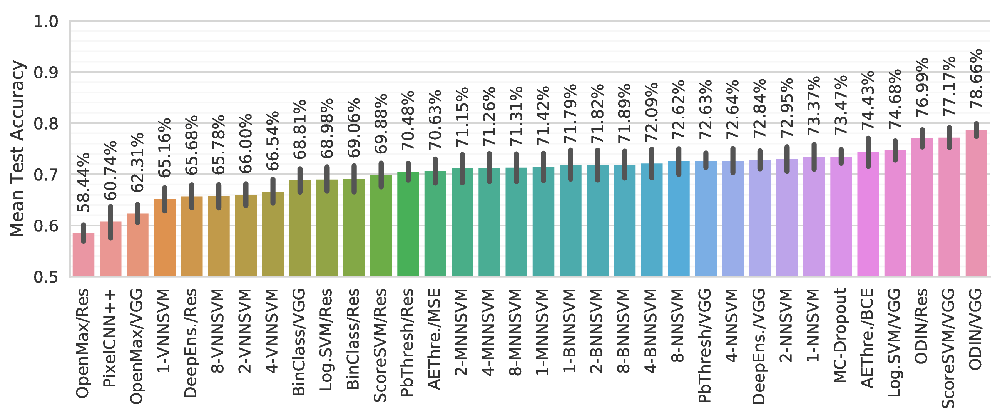
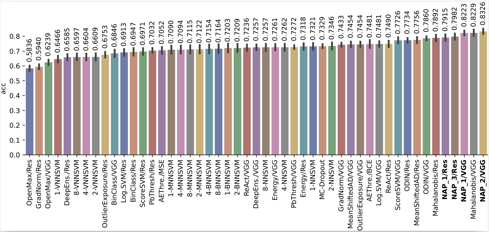
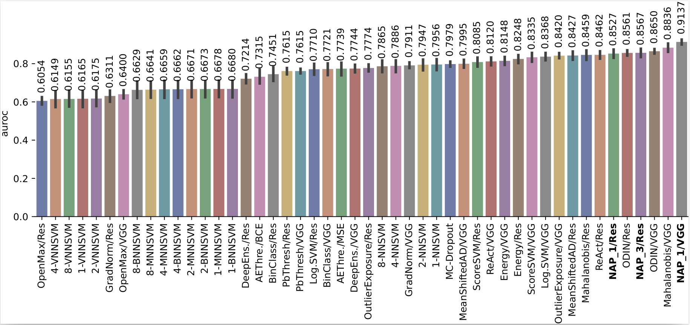
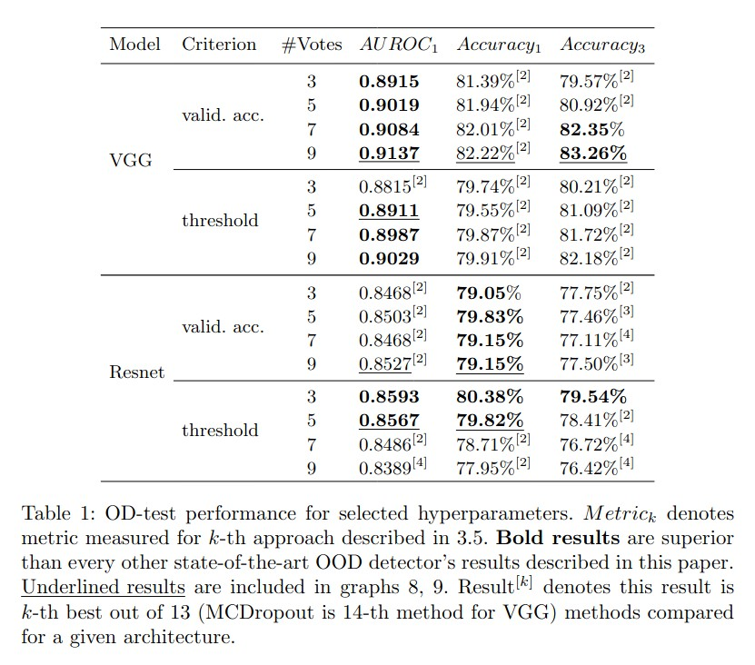

# Paper info

This repository is the official implementation of [Detection of out-of-distribution samples using binary neuron activation patterns](https://openaccess.thecvf.com/content/CVPR2023/papers/Olber_Detection_of_Out-of-Distribution_Samples_Using_Binary_Neuron_Activation_Patterns_CVPR_2023_paper.pdf)

```
@inproceedings{Olber2023,
    author = {B. Olber and K. Radlak and A. Popowicz and M.Szczepankiewicz and K. Chachula },
    booktitle = {2023 IEEE/CVF Conference on Computer Vision and Pattern Recognition (CVPR)},
    title = {{Detection of out-of-distribution samples using binary neuron activation patterns}},
    year = {2023}
}
```

# Original OD-test
This repository contains the extended version of the OD-test framework for evaluation Out-of-Distribution (OOD) detection methods. This framework was created based on OD-test framework and the paper [A Less Biased Evaluation of Out-of-distribution Sample Detectors](https://arxiv.org/abs/1809.04729)
released under the MIT License - see LICENSE_OD-test file. 
Please refer to Readme_OD-test.md for original readme file of the project. 

URL: https://github.com/ashafaei/OD-test.git

# Changelog
In comparison to the original OD-test, we implemented the following changes:
 - we migrated the code from Python 2 to Python 3
 - we replaced virtualenv to conda enviroment and we simplified the setup procedure
 - we added 7 state-of-the-art OOD detectors
 - we added a novel OOD detector based on Neuron Activation Patterns
 - we added new evaluation metric based on Area Under the Receiver Operating Characteristic (AUROC) curve

# Introduction
> The problem of interest is out-of-distribution (OOD) sample detection. In our paper, we present an evaluation framework called OD-test for methods that address OOD sample detection. We show that the traditional evaluation strategy yields overly-optimistic results, hence the need for more reliable evaluation. In this repository, we implement the OD-test for image recognition problems with deep neural networks. You can replicate all the results of our paper here.
> 
> The OOD detection problem arises in settings where the input of the neural network in a deployed system is not guaranteed to follow a fixed distribution. OOD inputs can lead to unpredictable behaviour in neural network pipelines. For instance, the neural network might be trained to recognize the MNIST digits, but then when deployed, it might encounter a natural image which it has never seen. Counter-intuitively, the trained neural networks often fail silently and make over-confident predictions on previously unseen input. We need to develop methods that detect OOD samples to prevent unpredictable behaviour. Unfortunately, we cannot filter out these problematic instances by thresholding the output probability of the most likely class. In the above image, we show the output of several popular CNNs trained on ImageNet but tested on random benign images that do not belong to ImageNet.
> 
> The code in this repository allows
> 
> 1. Painless replication of all the results in the paper. You can run from scratch or use the pretrained models.
> 2. Easy method development and testing for future work.
> 3. Quickly adding more datasets for evaluation.
> 
> I have spent a long time refining this code. The final result is a modularized codebase that is reasonably efficient. I recommend that you take the time to understand the general architecture of the project before making substantial changes. I welcome pull-requests. In particular, if you wish to add a new method to the evaluation or improve a part of the code. You can ask questions in [Issues](https://github.com/ashafaei/OD-test/issues).


## Quickstart

- First step: [setting up the project](#setup).
- Replicating all the results of the paper.
    - Training the *reference models* with an explanation of the training mechanics [here](docs/train_reference_models.md).
    - Get the pretrained models [here](docs/pretrained.md).
    - Running the evaluations with a quick example [here](docs/eval3d.md).
- Learn about the code organization [here](docs/code_organization.md).
- How to add
    - A new network architecture [here](docs/new.md#architecture).
    - A new dataset for evaluation [here](docs/new.md#dataset).
    - A new method for evaluation [here](docs/new.md#method).
- NAP configuration [here](docs/nap_configuration.md)

## List of the Datasets

| Index | Name          | Train     | Valid     | Test      | Input Dim         | #Classes  | D1?   |
|-------|---------------|-----------|-----------|-----------|-------------------|-----------|-------|
| 1     | MNIST         | (50,000   | 10,000)   | 10,000    | 28x28 = 784       | 10        | :heavy_check_mark:     |
| 2     | FashionMNIST  | (50,000   | 10,000)   | 10,000    | 28x28 = 784       | 10        | :heavy_check_mark:     |
| 3     | NotMNIST      |           |           |           | 28x28 = 784       | 10        | :x:     |
| 4     | CIFAR 10      | (40,000   | 10,000)   | 10,000    | 3x32x32 = 3,072   | 10        | :heavy_check_mark:     |
| 5     | CIFAR 100     | (40,000   | 10,000)   | 10,000    | 3x32x32 = 3,072   | 100       | :heavy_check_mark:     |
| 6     | TinyImagenet  | 100,000   | 10,000    | 10,000    | 3x64x64 = 12,288  | 200       | :heavy_check_mark:     |
| 7     | STL10         | 5,000     | (4,000    | 4,000)    | 3x96x96 = 27,648  | 10        | :heavy_check_mark:     |
| 8     | U(0,1)        |           |           |           | flexible          |           | :x:     |
| 9     | N(mu=0.5, sigma=0.25)|    |           |           | flexible          |           | :x:     |

## List of Implemented Methods

| Index | Name                         | Short Description                                                                                                                             | Code                                      |
|-------|------------------------------|-----------------------------------------------------------------------------------------------------------------------------------------------|-------------------------------------------|
| 1     | PbThreshold [1]              | A threshold on the maximum probability.                                                                                                       | [link](methods/base_threshold.py)         |
| 2     | ScoreSVM                     | A SVM on the logits (pre-softmax).                                                                                                            | [link](methods/score_svm.py)              |
| 3     | LogisticSVM                  | A SVM on the logits of a network trained with k-way logistic loss function.                                                                   | [link](methods/logistic_threshold.py)     | 
| 4     | MCDropout [2]                | MC-Dropout evaluation over 7 samples followed by a threshold on the entropy of average prediction.                                            | [link](methods/mcdropout.py)              | 
| 5     | KNNSVM                       | An SVM on the sorted Euclidean distance to K-nearest-neighbours.                                                                              | [link](methods/nearest_neighbor.py)       |
| 6     | ODIN [3]                     | A threshold on the scaled softmax outputs of the perturbed input.                                                                             | [link](methods/odin.py)                   |
| 7     | AEThreshold                  | A threshold on the autoencoder reconstruction error of the given input.                                                                       | [link](methods/reconstruction_error.py)   |
| 8     | DeepEnsemble [4]             | Similar to MCDropout, except we average over the predictions of 5 networks that are trained independently with adversarial data augmentation. | [link](methods/deep_ensemble.py)          |
| 9     | OpenMax [5]                  | Calibrated probability with additional unknown class and an SVM on top.                                                                       | [link](methods/openmax.py)                |
| 10    | K-MNNSVM, K-BNNSVM, K-VNNSVM | Similar to KNNSVM, but uses the latent representation of different (variational)-autoencoders.                                                | [link](methods/nearest_neighbor.py)       |
| 11    | NeuronActivationPatterns     | The new method proposed in this paper.                                                                                                        | [link](methods/nap/nap.py)                |
| 12    | Mahalanobis [6]              | Mahalanobis distance on feature space.                                                                                                        | [link](methods/mahalanobis/integrated.py) |
| 13    | MSAD [7]                     | Anomaly detection with mean-shifted contrastive loss.                                                                                         | [link](methods/msad.py)                   |
| 14    | GradNorm [8]                 | A threshold on gradient modulus of ultimate or penultimate layer.                                                                             | [link](methods/grad_norm.py)              |
| 15    | OutlierExposure [9]          | Probability calibration enhancement via fine-tuning a classifier with a loss that penalizes OOD samples.                                      | [link](methods/outlier_exposure.py)       |
| 16    | Energy [10]                  | Similar to OutlierExposure, except the fine-tuning is performed with energy loss.                                                             | [link](methods/energy.py)                 |
| 17    | ReAct [11]                   | Similar to Energy but feature activations are rectified.                                                                                      | [link](methods/react.py)                  |
| 18    | ASHB [12]                    | Binarization of the penultimate layer activations, then computing energy score.                                                               | [link](methods/ashb.py)                   |


## Average Performance (Sept. 13, 2018)


# What is new?

We have extended the original OD-test by adding 8 new OOD detectors (indices 11-18 on the [list](#list-of-implemented-methods)), including NeuronActivationPatterns.
AUROC is used to compare the methods alongside accuracy. The results of the extended OD-test are below.

## Average accuracy


## Average AUROC


## NAP results table


# Setup
The setup script creates a `workspace` folder within which all the subsequent project files will be put. To get started, you must first run the setup script.

```bash
> cd <root_folder>
> python setup/setup.py
```

Create a conda environment that includes all necessary packages: 

```bash
> conda env create -f environment.yml
```


# References

1. D. Hendrycks and K. Gimpel, “A Baseline for Detecting Misclassified and Out-of-Distribution Examples in Neural Networks,” ICLR, 2017.
2. Y. Gal and Z. Ghahramani, “Dropout as a Bayesian Approximation: Representing Model Uncertainty in Deep Learning,” in ICML, 2016.
3. S. Liang, Y. Li, and R. Srikant, “Enhancing The Reliability of Out-of-distribution Image Detection in Neural Networks,” ICLR, 2018.
4. B. Lakshminarayanan, A. Pritzel, and C. Blundell, “Simple and Scalable Predictive Uncertainty Estimation using Deep Ensembles,” in NIPS, 2017.
5. A. Bendale and T. E. Boult, “Towards Open Set Deep Networks,” in CVPR, 2016.
6. Lee, K., Lee, K., Lee, H., Shin, J.: A simple unified framework for detecting out-of-distribution samples and adversarial attacks (2018).
7. Reiss, T., Hoshen, Y.: Mean-shifted contrastive loss for anomaly detection (2021).
8. Huang, R., Geng, A., Li, Y.: On the importance of gradients for detecting distributional shifts in the wild (2021). 
9. Hendrycks, D., Mazeika, M., Dietterich, T.: Deep anomaly detection with outlier exposure (2019). 
10. Weitang Liu, Xiaoyun Wang, John Owens, and Yixuan Li. Energy-based out-of-distribution detection (2020). 
11. Yiyou Sun and Chuan Guo and Yixuan Li. ReAct: Out-of-distribution Detection With Rectified Activations (2021). 
12. A. Djurisic, N. Bozanic, A. Ashok, R. Liu Extremely Simple Activation Shaping for Out-of-Distribution Detection (2022).
